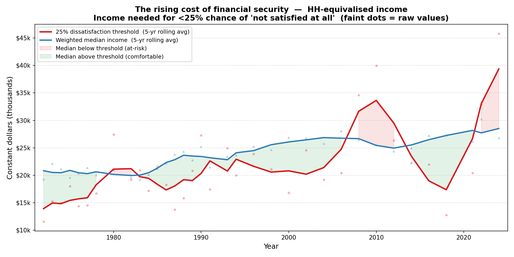
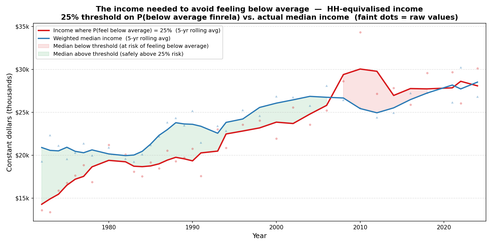

Real family income in the United States roughly doubled between 1972 and 2024 in constant dollars. Yet surveys consistently show that Americans are no happier — and no more financially satisfied — than they were half a century ago. How is that possible?

One answer is that expectations have risen alongside incomes. People don't evaluate their financial situation in a vacuum: they compare it to some internal benchmark of what "enough" looks like, and that benchmark shifts upward as society grows richer. If expectations rise as fast as incomes, subjective wellbeing goes nowhere even as objective circumstances improve.

This post uses fifty years of data from the General Social Survey (GSS) to put some numbers on that story. The GSS has asked Americans about their happiness and financial satisfaction every year or two since 1972, making it an unusually long window into how people's inner lives have tracked their material circumstances.

## Two ways to feel poor

The GSS includes two questions that get at financial wellbeing from different angles.

**`satfin`** asks: *How satisfied are you with your present financial situation?* Respondents choose between "pretty well satisfied," "more or less satisfied," and "not satisfied at all." This is an *absolute* measure — it reflects how you feel about your own situation, regardless of how others are doing.

**`finrela`** asks: *Compared with American families in general, would you say your family income is...?* The options run from "far below average" to "far above average." This is a *relative* measure — it captures where you think you stand in the income distribution.

Both questions have a conceptual problem that turns out to be analytically useful: neither should change over time if incomes and expectations rise together. If everyone gets richer by the same proportion, absolute satisfaction *might* rise (you can afford more), but relative standing *definitely* shouldn't — you're still in the same place in the distribution. So if relative standing is declining for the median household, something more structural is happening: reference points are shifting in a way that income growth doesn't explain.

## The methodology

For each survey year, I fit a logistic regression of the probability of reporting a bad financial outcome on the logarithm of household income (adjusted for household size using the OECD square-root equivalence scale). I then invert the regression to find a threshold: the income level at which a respondent has exactly a **25% probability** of reporting the bad outcome. That threshold — plotted against actual median income — shows how the "safety margin" has evolved over time.

Income is smoothed with a ±2 calendar year centred window to reduce year-to-year noise from the logistic regression.

One important caveat: the GSS income variable is derived from categorical brackets, and the top bracket captures a growing share of respondents over time (roughly 3% in 1972, rising to 15% by 2024). This top-coding attenuates measured income growth and can distort the logistic regression slope. The `finrela`-based analysis sidesteps this problem entirely, since it's a self-reported relative assessment that doesn't depend on the income variable at all.

## Financial dissatisfaction: the absolute benchmark

The first chart uses `satfin`. For each year, the red line shows the equivalised household income at which there is a 25% chance of reporting "not satisfied at all" with one's financial situation. The blue line shows the actual weighted median equivalised income of GSS respondents.

In 1972 the threshold sat well below median income — the typical household was comfortably above the point at which it risked financial dissatisfaction. Over time the threshold rose, and by the 1980s and again from the 2000s onwards, the median household found itself in or near the danger zone.

Note the volatility in the raw series (faint dots), which reflects the top-coding issue mentioned above: in years when the income bracket structure changes, the logistic slope can shift sharply. The smoothed trend is more reliable.

## Relative standing: the cleaner measure

The second chart uses `finrela`. The threshold here is the income at which there is a 25% chance of describing one's income as "below average" or "far below average." Because this is a relative self-assessment, it doesn't depend on the GSS income brackets — it's a direct reading of how respondents perceive their standing, and the logistic regression is much more stable year-to-year.

In 1972, the 25% threshold was roughly 70% of median income — the typical household needed to earn only 70 cents on every dollar of median income to feel comfortably above average. By the mid-2010s, that ratio had inverted: the threshold exceeded median income, meaning the typical household sat in the zone where more than one in four respondents feel below average. It has remained there since.

This is a striking result. It says that even though real incomes have risen, people's sense of what constitutes a "normal" income has risen faster. The median household, by this measure, is worse off in relative terms than it was fifty years ago.

## Why doesn't income growth help?

One reason the treadmill is so persistent is that income is a surprisingly weak predictor of happiness even at baseline levels. When I fit the 1972–75 happiness curve and simulate what 2% annual real income growth would have done to happiness — roughly the historical rate of GDP per capita growth — the predicted increase is only about 6 percentage points over fifty years. A tripling of real income barely moves the needle on wellbeing, because the income–happiness relationship is nearly flat across the income range that most households occupy.

This means the expectations treadmill doesn't need to run very fast to cancel out the gains from income growth. A modest upward drift in reference points — the kind that happens naturally as everyone around you gets richer — is enough to leave subjective wellbeing unchanged.

## What this means

The gap between rising incomes and stagnant wellbeing is not simply a measurement artifact or a quirk of survey design. It shows up consistently across two different questions, two different methodologies, and fifty years of data. The most parsimonious explanation is that people's sense of financial adequacy is anchored to the distribution of incomes around them, and that anchor rises with the distribution.

This has implications for policy. If the goal is to improve subjective wellbeing — not just material living standards — then policies that raise incomes broadly may be less effective than policies that reduce inequality (which would lower the reference point for the median household) or that directly address the sources of insecurity that drive dissatisfaction.

The code for all analyses, along with instructions for downloading the GSS data, is available at [github.com](https://github.com).

---

*Data: General Social Survey, NORC at the University of Chicago, 1972–2024. Income adjusted to constant dollars and equivalised for household size (OECD square-root scale). Survey weights (wtssps) applied throughout.*
